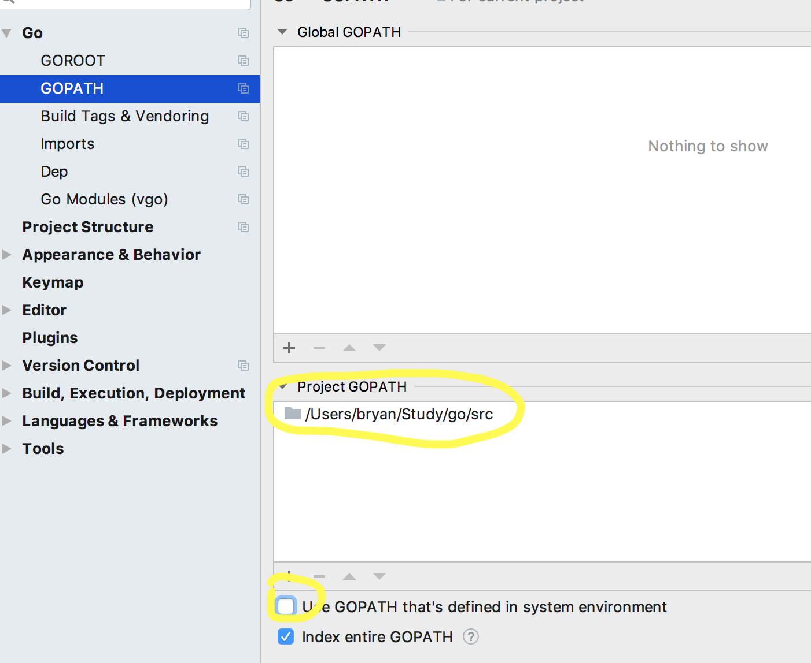

# go

## Prereqs

Always good to have latest command line tools and Xcode (LLDB debuggers etc..)

[xcode](xcode.md)

## Tools

Install tools with convenience script ...

```bash
$ installgotools

Installing gocode (auto completion) ...
Installing gooutline (symbol search current file) ...
Installing gosymbols (symbol search in current workspace)...
....
```

Test:

```bash
$ which gocode
/Users/bryan/Tools/bin/gocode
```

See scripts/installgotools.sh

## Command Line Scripts

### gb

go build, fmt and install to bin (in path)

### gr

gb and then run

```bash
[dev] $ gb
building helloworld

[dev] $ which helloworld
/Users/bryan/Study/go/bin/helloworld

[dev] $ gr
building helloworld
running helloworld
Hello World!
```

## VS Code

### Install plug in

Install "Go for Visual Studio Code" (ms-vscode.go)

Set tools bin path in VS Code

Code, Preferences, Settings, User settings
... Open settings.json
Set go.toolsGoPath to Tools path

```javascript
{
    "git.ignoreMissingGitWarning": true,
    "workbench.startupEditor": "newUntitledFile",
    "go.toolsGopath": "/Users/bryan/Tools"
}
```

note: I used to point directly to Tools/bin but a recent vscode go plugin wants me to point to Tools and bin is implied.

### Modules

Modules are experimental in go 1.11

[Modules Overview](https://github.com/golang/go/wiki/Modules)

unset $GOPATH.  shortcut gomod provided
```bash
$ gomod
$ echo $GOPATH

$
```

For `gr` shortcut, keep the folder name the executable name.  For example, in the modules walkthrough above, I named package hellomod in the hellomod folder (instead of hello in the mod folder).  A good convention.

Notice this commit added tools gocode-mod and godef-mod

### Debug

[VS Code Debug Wiki](https://github.com/Microsoft/vscode-go/wiki/Debugging-Go-code-using-VS-Code)

Start remote debugger in the prog dir (addresses STDIN issue below):

```bash
$ cd someprogram
$ gd
API server listening at: [::]:2345
...
```

pass arguments to the program being debugged:

```bash
$ gd arg1 arg2
```

Create a 'Remote' config in VS Code, set breakpoints and debug.

```bash
    "configurations": [
        {
            "name": "Remote",
            "type": "go",
            "request": "launch",            
            "mode": "remote",
            "program": "${fileDirname}",
            "remotePath": "${fileDirname}",
            "port": 2345,
            "host": "127.0.0.1",            
            "env": {},
            "apiVersion": 1,
            "args": []
        }
```

ISSUE: Can't debug a [program using stdin](https://github.com/Microsoft/vscode-go/issues/219#issuecomment-192164367).

## GoLand

Open.  From terminal:

```bash
$ goland
```

Create a new project (new folder or existing):

Preferences (or wrench bottom right).  Set GOPATH for project and uncheck from env.  This means you can launch from anywhere



## Debugging with Delve in Terminal

[Delve from the cmdline](https://lincolnloop.com/blog/debugging-go-code/)

```bash
[dev] ~/Study/go/src/helloworld$ dlv debug main.go -- arg1
Type 'help' for list of commands.
(dlv) break main.go:9
Breakpoint 1 set at 0x10ae9e4 for main.main() ./main.go:9
(dlv) break main.go:10
Breakpoint 2 set at 0x10aeaa0 for main.main() ./main.go:10
(dlv) continue
> main.main() ./main.go:9 (hits goroutine(1):1 total:1) (PC: 0x10ae9e4)
     4:		"fmt"
     5:	)
     6:	
     7:	func main() {
     8:		msg := "Hellow World!"
=>   9:		fmt.Println(msg)
    10:		fmt.Println("")
    11:	}
(dlv) print msg
"Hellow World!"
(dlv) continue
Hellow World!
> main.main() ./main.go:10 (hits goroutine(1):1 total:1) (PC: 0x10aeaa0)
     5:	)
     6:	
     7:	func main() {
     8:		msg := "Hellow World!"
     9:		fmt.Println(msg)
=>  10:		fmt.Println("")
    11:	}
(dlv) continue

Process 6739 has exited with status 0
(dlv) exit
Process 6739 has exited with status 0
[dev] ~/Study/go/src/helloworld$ 
```

### Debugging Stdin Issues

Version 2018.2 (use this):
Preferences | Build, Execution, Deployment | Debugger and enable the Use native backend option.

Enable the PTY mode for the run configuration as this is not something that is supported by default. Press CTRL|Command + ALT + SHIFT + / then go to Registry, start typing run.processes.with.pty and enable this option.

Version 2018.3: 

This doesn't work because of [stdin debugging](https://youtrack.jetbrains.com/issue/GO-4264) needs [native backend](https://github.com/derekparker/delve/issues/1112)

https://github.com/derekparker/delve/blob/master/Documentation/installation/osx/install.md#compiling-the-native-backend

Then edit custom properties of IDE: Help | Edit Custom Properties and add there two lines:

dlv.path=<path/to/your/compiled/dlv>
dlv.native.backend=true

## Useful Links

[VGO Dependency Management](https://blog.spiralscout.com/golang-vgo-dependency-management-explained-419d143204e4)

[GoLand Stdin Debugging Issue](https://youtrack.jetbrains.com/issue/GO-4264)
