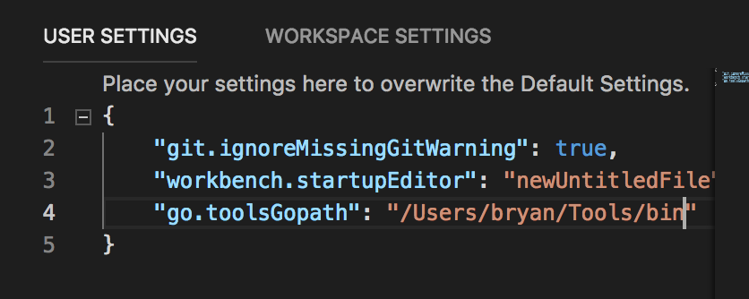

# go

## Prereqs

Always good to have latest command line tools and Xcode (LLDB debuggers etc..)

[xcode](xcode.md)

## Tools

Install tools with convenience script ...

```bash
$ installgotools

Installing gocode (auto completion) ...
Installing gooutline (symbol search current file) ...
Installing gosymbols (symbol search in current workspace)...
....
```

Test:

```bash
$ which gocode
/Users/bryan/Tools/bin/gocode
```

See scripts/installgotools.sh

## VS Code

## Install plug in

Install "Go for Visual Studio Code" (ms-vscode.go)

Set tools bin path in VS Code

Code, Preferences, Settings
... Open settings.json
Set go.toolsGoPath to Tools/bin path



ISSUE: Can't debug a [program using stdin](https://github.com/Microsoft/vscode-go/issues/219#issuecomment-192164367).  

## GoLand

Open.  From terminal:

```bash
$ goland
```

### Project Level Preferences

Create a new project (new folder or existing)

Preferences (or wrench bottom right).  Set GOPATH for project and uncheck from env.  This means you can launch from anywhere


### Debugging Stdin Issues

Version 2018.2 (use this):
Preferences | Build, Execution, Deployment | Debugger and enable the Use native backend option.

Enable the PTY mode for the run configuration as this is not something that is supported by default. Press CTRL|Command + ALT + SHIFT + / then go to Registry, start typing run.processes.with.pty and enable this option.

Version 2018.3: 

This doesn't work because of [stdin debugging](https://youtrack.jetbrains.com/issue/GO-4264) needs [native backend](https://github.com/derekparker/delve/issues/1112)

https://github.com/derekparker/delve/blob/master/Documentation/installation/osx/install.md#compiling-the-native-backend

Then edit custom properties of IDE: Help | Edit Custom Properties and add there two lines:

dlv.path=<path/to/your/compiled/dlv>
dlv.native.backend=true

## Useful Links

[VGO Dependency Management](https://blog.spiralscout.com/golang-vgo-dependency-management-explained-419d143204e4)

[GoLand Stdin Debugging Issue](https://youtrack.jetbrains.com/issue/GO-4264)
