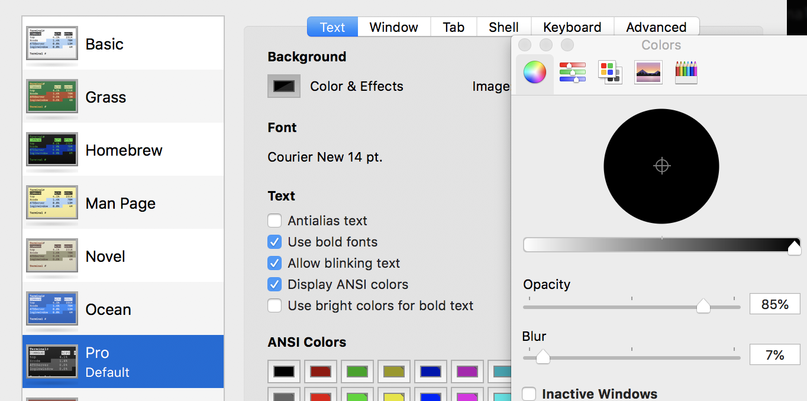
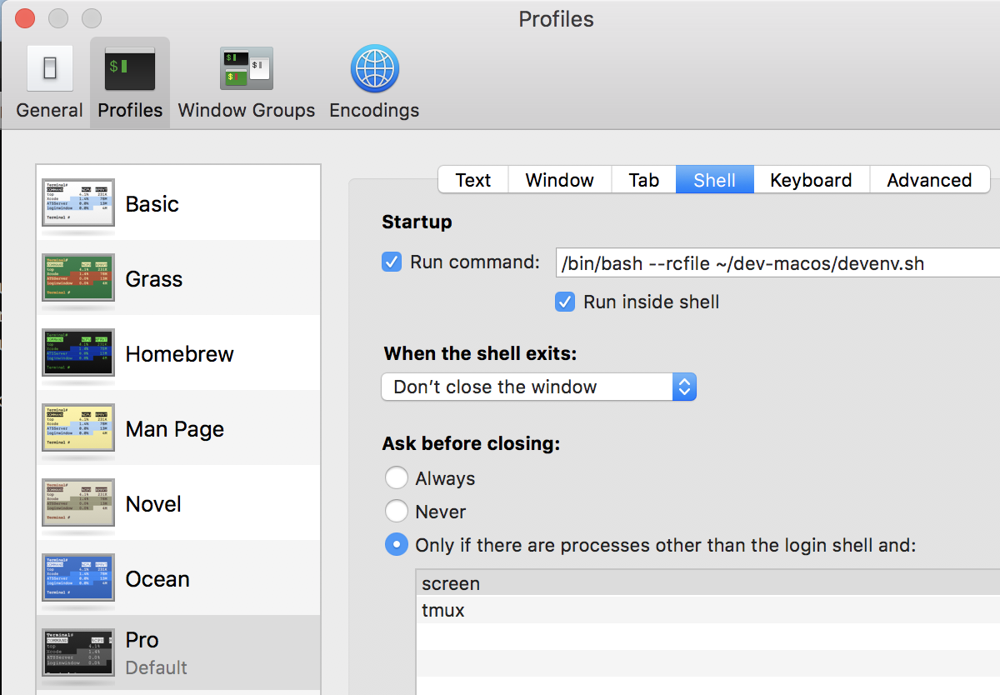

# Mac Terminal

Terminal, Preferences ...

Pro, make default  

## Look and Feel

Courier New 14 pt, Opacity 85%, Blur 7%



## Starup Script

In Shell tab: 

**Run Command:** /bin/bash --rcfile ~/dev-macos/devenv.sh



open a new terminal and test it out

```bash
[dev] ~/Projects$ study
[dev] ~/Study$ tools
[dev] ~/Tools$ proj
[dev] ~/Projects$ aliases
```